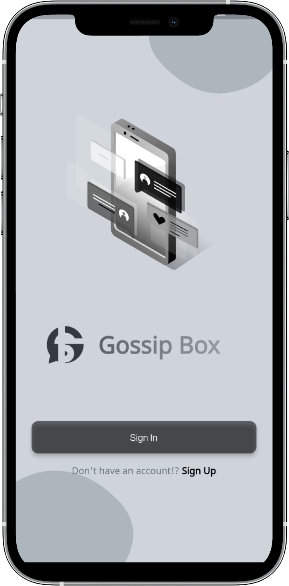
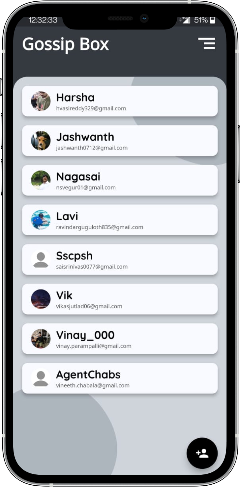
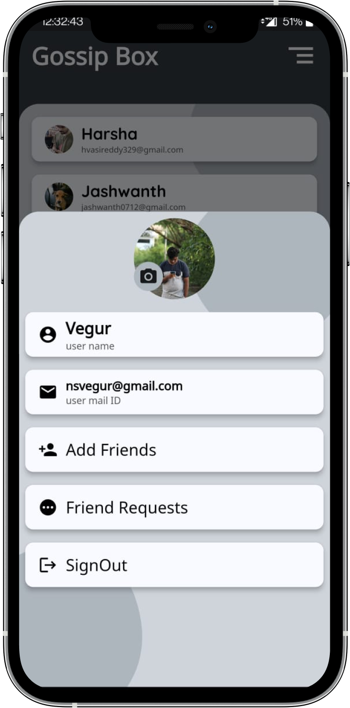
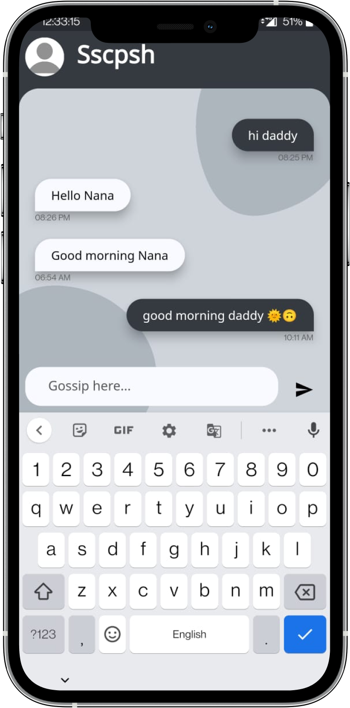
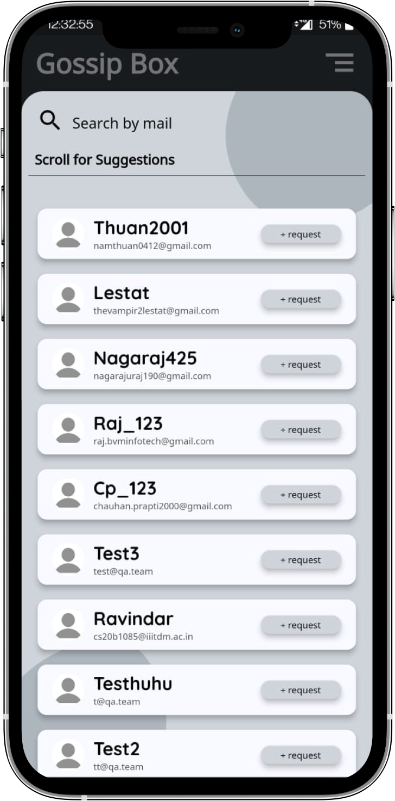
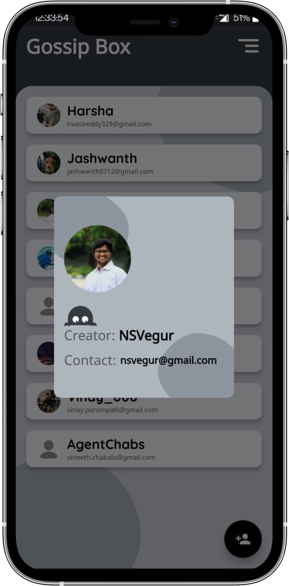

# GossipBox

   
   

This is a simple chat application with appealing UI built with firebase as DB. You can add friends based on their registered email and start gossiping with them. 

## 

# Preview

|                                          |                                          |
| ---------------------------------------- | ---------------------------------------- |
|  |  |
|  |  |
|  |  |

--------------------------------------------------------------------------------------------------------------------------------------------------------------------

## Found this project useful?

If you found this project useful, then please consider giving it a :star: on Github and sharing it with your friends via social media.

## Getting Started With Flutter

This project is a starting point for a Flutter application.

A few resources to get you started if this is your first Flutter project:

- [Lab: Write your first Flutter app](https://flutter.dev/docs/get-started/codelab)
- [Cookbook: Useful Flutter samples](https://flutter.dev/docs/cookbook)

For help getting started with Flutter, view our
[online documentation](https://flutter.dev/docs), which offers tutorials,
samples, guidance on mobile development, and a full API reference.

--------------------------------------------------------------------------------------------------------------------------------------------------------------------
  
 
 

  
Contact Me: 

  
  
   
    

 
 ## ✍🏽 Author: NSVEGUR

